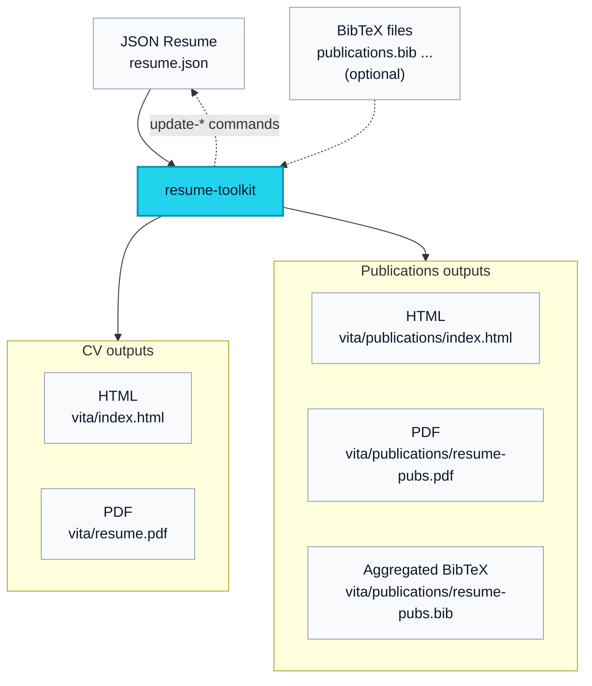

# Resume Toolkit - JSONresume/BibTeX to HTML/PDF

<a href="https://hub.docker.com/repository/docker/zzamboni/resume-toolkit"></a>


`resume-toolkit` provides a reusable pipeline for converting [JSON Resume](https://jsonresume.org/) (and optionally, BibTeX files) into:

-   Resume HTML, using a customized version of the [jsonresume-theme-even](https://github.com/rbardini/jsonresume-theme-even)) theme;
-   Resume Typst/PDF using the [brilliant-cv](https://typst.app/universe/package/brilliant-cv) theme, automatically fetching company/school logos from [logo.dev](https://logo.dev/);
-   Standalone publications HTML page (from BibTeX);
-   Standalone publications PDF (from BibTeX, rendered with Typst);
-   Aggregated publications BibTeX.

It also allows updating your JSONresume file with a list of certifications from [Credly](https://credly.com/) (including badges), a list of publications from BibTeX files, and links to the standalone publications HTML page.



You can see a live real example at <https://zzamboni.org/vita/>.

You can find some further samples in the `samples/` directory:

- [`samples/example-resume/`](samples/example-resume): fully synthetic example which shows a variety of features.
- [`samples/john-doe-brilliantcv/`](samples/john-doe-brilliantcv): the sample resume from [Brilliant-CV](https://typst.app/universe/package/brilliant-cv) (the one produced when you run `typst init @preview/brilliant-cv`) converted to JSONresume format, to show the Typst rendering abilities (the resulting PDF is nearly identical).

---

<!-- markdown-toc start - Don't edit this section. Run M-x markdown-toc-refresh-toc -->
**Table of Contents**

- [Resume Toolkit - JSONresume/BibTeX to HTML/PDF](#resume-toolkit---jsonresumebibtex-to-htmlpdf)
  - [Requirements and installation](#requirements-and-installation)
  - [Quick Start](#quick-start)
  - [Output Layout](#output-layout)
  - [Main subcommands](#main-subcommands)
    - [`build` (default)](#build-default)
    - [`fetch-logos`](#fetch-logos)
    - [`update-certs`](#update-certs)
    - [`update-pub-numbers`](#update-pub-numbers)
    - [`update-inline-pubs`](#update-inline-pubs)
    - [Other subcommands](#other-subcommands)
  - [Bibliography configuration](#bibliography-configuration)
  - [Even theme extensions](#even-theme-extensions)
    - [Font Awesome Icons](#font-awesome-icons)
    - [Certificate badges and notes](#certificate-badges-and-notes)
    - [Grouping projects by type](#grouping-projects-by-type)
    - [Section custom ordering and labels](#section-custom-ordering-and-labels)
      - [Ordering](#ordering)
      - [Custom Labels](#custom-labels)
    - [Table of contents](#table-of-contents)
    - [Floating links](#floating-links)
    - [PDF theme layout](#pdf-theme-layout)
  - [Environment Variables](#environment-variables)
  - [Under the Hood](#under-the-hood)
    - [Automated Tests](#automated-tests)

<!-- markdown-toc end -->

---

<a id="orge0cfd3e"></a>

## Requirements and installation

The recommended interface is the wrapper script `build-resume.sh`, which runs everything inside a [Docker image](https://hub.docker.com/repository/docker/zzamboni/resume-toolkit/settings).

-   Docker
-   A file in [JSON Resume](https://jsonresume.org/) format (with optional extensions as described below)
-   Optional BibTeX file(s) for publications

If no BibTeX files are provided, the publications outputs are skipped.

To install, download the [build-resume.sh](https://github.com/zzamboni/resume-toolkit/blob/main/build-resume.sh) script and make it executable:

``` sh
wget https://raw.githubusercontent.com/zzamboni/resume-toolkit/refs/heads/main/build-resume.sh
chmod a+rx build-resume.sh
```

The first time the script runs, it will download the Docker image automatically.

<a id="org90b52ae"></a>

## Quick Start

Build a Resume + publications:

```sh
build-resume.sh resume.json pubs-src/publications.bib
```

Build the bundled examples:

```sh
build-resume.sh samples/example-resume/example-resume.json
```

or

```sh
build-resume.sh samples/john-doe-brilliantcv/john-doe-brilliantcv.json
```

Then open <http://localhost:8080>


<a id="org1334766"></a>

## Output Layout

Default output base directory:

-   `build/<resume-stem>/`

Generated files:

- CV HTML:  `build/<resume-stem>/vita/index.html`
- CV Typst:  `build/<resume-stem>/vita/<resume-stem>.typ`
- CV PDF:  `build/<resume-stem>/vita/<resume-stem>.pdf`
- Publications HTML (if BibTeX provided): `build/<resume-stem>/vita/publications/index.html`
- Publications PDF (if BibTeX provided): `build/<resume-stem>/vita/publications/<resume-stem>-pubs.pdf`
- Publications aggregated BibTeX (if BibTeX provided): `build/<resume-stem>/vita/publications/<resume-stem>-pubs.bib`


<a id="org8964c26"></a>

## Main subcommands

``` sh
$ build-resume.sh --help
Usage:
  build-resume.sh [build] <resume.json> [bibfiles...] [--out <dir>] [--pubs-url <url>] [--cv-url <url>] [--watch] [--serve] [--no-fetch-logos]
  build-resume.sh fetch-logos <resume.json> [--overwrite] [--dry-run] [--token LOGODEV_TOKEN]
  build-resume.sh update-certs <username> <resume.json> [--include-expired] [--include-non-cert-badges] [--sort <date_desc|date_asc|name>]
  build-resume.sh update-pub-numbers <resume.json> [--html <path>]
  build-resume.sh version
```

<a id="org6cb0f47"></a>

### `build` (default)

```sh
build-resume.sh [build] <resume.json> [bibfiles...] [--out <dir>] [--pubs-url <url>] [--cv-url <url>] [--watch] [--serve] [--no-fetch-logos]
```

These are equivalent:

```sh
build-resume.sh build resume.json pubs-src/publications.bib
build-resume.sh resume.json pubs-src/publications.bib
```

Options:

-   `--out <dir>`: output base directory (default `build/<resume-stem>`)
-   `--pubs-url <url>`: online publications URL for standalone publications PDF footer
-   `--cv-url <url>`: online CV URL for main resume PDF footer
-   `--watch`: rebuild on input changes
-   `--serve`: start HTTP server (implies `--watch`)
-   `--no-fetch-logos`: disable automatic logo fetching when `assets/logos/` is missing

If no BibTeX files are provided on the command line, the pipeline can read them from a special entry in the `publications` section of your JSON resume:

```json
"publications": [
  {
    "authors": ["Example Person"],
    "bibfiles": ["pubs.bib", "patents.bib"]
  }
]
```

Only one `publications[]` entry may define `bibfiles`. If `--bib` arguments are provided, they take precedence. `bibfiles` entries are resolved relative to the JSON resume file location.

If no source `assets/logos/` directory is found, the pipeline will automatically try to populate it by running the logo fetcher (see [`fetch-logos`](#orgd64b9f2)). If `LOGODEV_TOKEN` is not available, the build continues but emits a warning and skips automatic logo download. Use `--no-fetch-logos` to disable both the automatic fetch and the warning.


<a id="orgd64b9f2"></a>

### `fetch-logos`

Download company/institution logos from the resume file into `assets/logos/` in your working directory. Uses [logo.dev](https://www.logo.dev/) to fetch logos. You need to create an API key and provide the publishable key in the `LOGODEV_TOKEN` environment variable, or using the `--token` flag.

If matching logo files are found under `assets/logos/`, the `build` step will include them automatically in the generated PDF. You can also provide/update the images by hand with the appropriate name (`<company name>.png/jpg/jpeg/svg/webp/gif`).

```sh
build-resume.sh fetch-logos resume.json
```

Options:

-   `--overwrite`
-   `--dry-run`
-   `--token <token>` (or set `LOGODEV_TOKEN`)


<a id="orgdc97180"></a>

### `update-certs`

Sync certificates from Credly into your JSON resume. This replaces any entries in the `certificates` section of the JSONresume file that have a `url` field pointing to `credly.com`. Other entries are left untouched.

```sh
build-resume.sh update-certs <credly-username> resume.json
```

Options:

-   `--include-expired`
-   `--include-non-cert-badges`
-   `--sort <date_desc|date_asc|name>` (default `date_desc`)


<a id="orgeb8b253"></a>

### `update-pub-numbers`

Update publication reference numbers in your JSON resume using the generated publications HTML anchors.

```sh
build-resume.sh update-pub-numbers resume.json
```

Options:

-   `--html <path>` (defaults to `build/<resume-stem>/vita/publications/index.html`)


### `update-inline-pubs`

Replace inline `publications[]` entries in your JSON resume from the BibTeX selection defined by the generated-publications entry.

```sh
build-resume.sh update-inline-pubs resume.json
```

Optional BibTeX files can be passed explicitly to override the `bibfiles` configured in `publications[]`. The command keeps the single special `publications[]` entry with `bibfiles` and regenerates all other `publications[]` entries using the JSON Resume schema fields `name`, `publisher`, `releaseDate`, `url`, and `summary`.


<a id="org23204b4"></a>

### Other subcommands

```sh
build-resume.sh shell
```

Gives you an interactive shell inside the container.

<a id="bibliography-config"></a>

## Bibliography configuration

If no BibTeX files are provided on the command line, the pipeline can read them from a special `publications[]` entry in your JSON resume. BibTeX files will be used to produce the standalone publications pages (HTML and PDF):

```json
"publications": [
  {
    "authors": ["Example Person"],
    "bibfiles": ["pubs.bib", "patents.bib"]
  }
]
```

Only one `publications[]` entry may define `bibfiles`. If `name` is omitted on that entry it defaults to `"Full list online"`, and if `url` is omitted it defaults to `"publications/"`. `bibfiles` entries are resolved relative to the JSON resume file location. If `--bib` arguments are provided, they take precedence.

By default, publications from bib files are rendered in a separate HTML/PDF document (any publications specified directly within the `publications` list in the JSON file are rendered inline).

If `meta.publicationsOptions.inline_in_pdf` is set, the resume PDF embeds the aggregated publications list directly using Typst and the `pergamon` bibliography package. HTML publications generation is unchanged.

-   If `"inline_in_pdf": true`, defaults are used:
    -   `ref-style: "ieee"`
    -   `ref-full: true`
    -   `ref-sorting: "ydnt"`
-   `bibentries` can be set on the generated-publications `publications[]` entry to select explicit BibTeX entry keys for inline PDF publications, and also for standalone publications when `full_standalone_list` is `false`.
-   `bibkeywords` can be set on the generated-publications `publications[]` entry to include entries whose BibTeX `keywords` contain any of the listed values for inline PDF publications, and also for standalone publications when `full_standalone_list` is `false`.
-   `full_standalone_list` defaults to `true`, meaning the standalone publications HTML/PDF pages render the full list from `bibfiles` while the inline PDF bibliography can still be filtered by `bibentries` / `bibkeywords`. Set it to `false` to apply the same filtering to the standalone publications outputs.
-   You can also pass a dictionary to configure the inline bibliography rendering, for example:

```json
"meta": {
  "publicationsOptions": {
    "inline_in_pdf": {
      "ref-style": "ieee",
      "ref-full": true,
      "ref-sorting": "ydnt"
    }
  }
}
```

You can also configure publication sectioning for both HTML and PDF via `meta.publicationsOptions`:

-   `pubSections: true`: default publication section order and titles (see below)
-   `pubSections: ["..."]`: custom section order/selection (matched against BibTeX `keywords`)
-   `pubSections: false` or unset: no sectioning (single publications list)
-   `pubSectionTitles`: optional custom titles for section keys
-   `links`: optional floating action links for the publications HTML page
-   `full_standalone_list_title`: optional title for the standalone publications HTML/PDF pages (defaults to `Publications`)

If `meta.publicationsOptions.links` is unset, the publications HTML page gets these default floating links:

```json
[
  {
    "name": "PDF",
    "url": "<publications>.pdf",
    "icon": "file-pdf"
  },
  {
    "name": "BibTeX",
    "url": "<publications>.bib",
    "icon": "tex"
  }
]
```

`<publications>` is replaced with the generated publications base filename for the current resume, and `<resume>` is replaced with the main resume file stem. If `links` is present but empty (`[]`), no floating links are rendered. Icon names can be plain Font Awesome names like `file-pdf`, or Font Awesome style strings like `fa-regular fa-file-pdf` or `fa-brands fa-github`.

The same `pubSections` / `pubSectionTitles` configuration applies both to the standalone publications PDF and to inline publications rendered inside the resume PDF.

If you set `meta.site.url`, relative links are kept relative in the HTML output but are resolved against that base URL in the generated PDF outputs. This applies both to explicit `url` fields and to Markdown links embedded inside text fields such as `summary` or `highlights`.

If `pubSections` is set to `true`, the following default values are used:

``` python
DEFAULT_SECTION_ORDER = [
    "book",
    "editorial",
    "thesis",
    "refereed",
    "techreport",
    "presentations",
    "invited",
    "patent",
    "other",
]

DEFAULT_SECTION_TITLES = {
    "book": "Books",
    "editorial": "Editorial Activities",
    "thesis": "Theses",
    "refereed": "Refereed Papers",
    "techreport": "Technical Reports",
    "presentations": "Presentations",
    "invited": "Invited Talks and Articles",
    "patent": "Patents",
    "other": "Other Publications",
}
```

Example:

```json
"publications": [
  {
    "authors": ["Example Person"],
    "bibfiles": ["pubs.bib", "patents.bib"],
    "bibkeywords": ["selected", "important"],
    "bibentries": ["zamboni20:emacs-org-leanpub"]
  }
],
"meta": {
  "publicationsOptions": {
    "inline_in_pdf": {
      "ref-style": "ieee",
      "ref-full": false,
      "ref-sorting": "ydnt"
    },
    "links": [
      {
        "name": "PDF",
        "url": "<publications>.pdf",
        "icon": "file-pdf"
      },
      {
        "name": "BibTeX",
        "url": "<publications>.bib",
        "icon": "tex"
      }
    ],
    "pubSections": ["refereed", "patent", "other"],
    "pubSectionTitles": {
      "refereed": "Journal Articles",
      "patent": "Patents",
      "other": "Other Publications"
    }
  }
}
```

<a id="even-theme-extensions"></a>

## Even theme extensions

The version of jsonresume-theme-even used by this toolkit supports the following additional options (described also in [jsonresume-them-even PR#33](https://github.com/rbardini/jsonresume-theme-even/pull/33)):

### Font Awesome Icons

By default, [Feather icons](https://feathericons.com/) are used for the profiles. You can also use [Font Awesome icons](https://fontawesome.com/) by setting the `.meta.themeOptions.icons` resume field to "fontawesome":

```json
{
  "meta": {
    "themeOptions": {
      "icons": "fontawesome"
    }
  }
}
```

### Certificate badges and notes

If a [certificate](https://docs.jsonresume.org/schema#certificates) entry contains an `image` field, it is used as the URL of an image to display next to the entry as a badge for the certificate.

If a certificate entry contains only `name` and optionally `url` but no `issuer` or `date`, it is considered as a "note" entry and rendered at the top of the list in a different format (for example to link to a full list).

### Grouping projects by type

If the `.meta.themeOptions.projectsByType` is `true`, project entries are rendered as separate sections according to their `type` field, instead of as a single section.

### Section custom ordering and labels

#### Ordering

You can override what sections are displayed, and in what order, via the `.meta.themeOptions.sections` resume field.

Here's an example with all available sections in their default order:

```json
{
  "meta": {
    "themeOptions": {
      "sections": [
        "work",
        "volunteer",
        "education",
        "projects",
        "awards",
        "certificates",
        "publications",
        "skills",
        "languages",
        "interests",
        "references"
      ]
    }
  }
}
```

Any sections not in the above list are not registered and won't be displayed in the final render.

#### Custom Labels

You can override the default section labels. Particularly useful if you want to translate a resume into another language.

```json
{
  "meta": {
    "themeOptions": {
      "sectionLabels": {
        "work": "Jobs",
        "projects": "Projekter"
      }
    }
  }
}
```

If `.meta.themeOptions.projectsByType` is `true`, you can also break out project types into individually ordered sections by using `projects:<type>` entries. For example:

```json
{
  "meta": {
    "themeOptions": {
      "projectsByType": true,
      "sections": ["work", "projects:application", "projects:library", "skills"],
      "sectionLabels": {
        "projects:application": "Apps",
        "projects:library": "Libraries"
      }
    }
  }
}
```

### Table of contents

You can enable a floating table of contents on the right side of the screen by setting `.meta.themeOptions.showTableOfContents` to `true`:

```json
{
  "meta": {
    "themeOptions": {
      "showTableOfContents": true
    }
  }
}
```

The table of contents automatically includes links to all resume sections that have content, plus a "Top" link to return to the beginning of the document. The active section is highlighted as you scroll through the resume. The table of contents is automatically hidden on smaller screens and in print mode.

### Floating links

You can add floating action links in the bottom-right corner by setting `.meta.themeOptions.links` to an array of `{ name, url, icon }` objects. The `icon` value can be a plain Font Awesome name like `github`, or a Font Awesome class-style string such as `fa-regular fa-file-pdf` or `fa-brands fa-github`. In the `url` field, `<resume>` is replaced with the current resume file stem and `<publications>` with the generated publications file stem before rendering.

If `.meta.themeOptions.links` is not set, the toolkit provides default links for the generated PDF CV and, when a standalone publications page is built, for that publications page as well. If `links` is explicitly set to an empty list (`[]`), no resume floating links are rendered.

Default generated links:

```json
[
  { "name": "PDF version", "url": "<resume>.pdf", "icon": "fa-regular fa-file-pdf" },
  { "name": "Publications page", "url": "publications/", "icon": "fa-quote-left" }
]
```

The publications link is only included when the resume defines a standalone publications page via `publications[].bibfiles`.

Custom example:

```json
{
  "meta": {
    "themeOptions": {
      "links": [
        { "name": "PDF", "url": "<resume>.pdf", "icon": "file-pdf" },
        { "name": "Publications", "url": "publications/", "icon": "fa-regular fa-file-pdf" },
        { "name": "GitHub", "url": "https://github.com/zzamboni", "icon": "github" }
      ]
    }
  }
}
```

### PDF theme layout

You can override values from `brilliant-cv`'s `metadata.layout` by setting
`meta.pdfthemeOptions.layout` in your resume JSON. Any fields you do not set
use the defaults from brilliant-cv's built-in template.

Two additional keys are also supported under `meta.pdfthemeOptions.layout` for
section heading rendering:

- `highlighted`
- `letters`
- `summary_title`

At the `meta.pdfthemeOptions` level, you can also set `visible_urls` to
control where compact visible URLs are shown in the PDF output. It defaults
to `["notes"]`. Supported values are `notes`, `profiles`, `projects`,
`all`, and `none`.

You can also set footer URLs at the `meta.pdfthemeOptions` level:

- `pubs_url`: URL shown in the footer of the standalone publications PDF
- `cv_url`: URL shown in the footer of the main CV PDF

Command-line `--pubs-url` and `--cv-url` values override these config entries.

If `highlighted` or `letters` are set, they are passed explicitly to
`#cv-section(...)`. If they are omitted, nothing is passed and
`brilliant-cv`'s own defaults are used.

`summary_title` is separate: it controls whether the `Summary` heading is
rendered at all for non-empty summaries in the PDF output. It defaults to
`false`.

Example:

```json
{
  "meta": {
    "pdfthemeOptions": {
      "layout": {
        "awesome_color": "red",
        "highlighted": false,
        "letters": 3,
        "summary_title": true,
        "header": {
          "header_align": "center",
          "info_font_size": "9pt"
        },
        "footer": {
          "display_page_counter": true
        }
      }
    }
  }
}
```

<a id="orgc2ef02d"></a>

## Environment Variables

-   `VITA_PIPELINE_IMAGE`: Docker image (default: `zzamboni/resume-toolkit:latest`)
-   `VITA_SERVE_PORT`: serve port (default: `8080`)
-   `VITA_PIPELINE_CACHE_DIR`: host cache dir for container caches
-   `LOGODEV_TOKEN`: token used by `fetch-logos`


<a id="org79da12a"></a>

## Under the Hood

The wrapper runs:

-   containerized entrypoint in `docker/entrypoint.sh`
-   pipeline script `scripts/run_pipeline.sh`
-   supporting converters in `scripts/`

The container uses a customized version of `themes/jsonresume-theme-even` as a git submodule, cloned from <https://github.com/zzamboni/jsonresume-theme-even/tree/feat-multiple-features>.

Clone with submodules enabled:

```sh
git clone --recurse-submodules https://github.com/zzamboni/resume-toolkit.git
```

If you already cloned without submodules:

```sh
git submodule update --init --recursive
```

You can build the Docker image locally with:

``` sh
mise toolkit-image-build
```

<a id="org487a931"></a>

### Automated Tests

Container integration tests live under `tests/container/`.

Run tests:

```sh
mise test-toolkit
```
