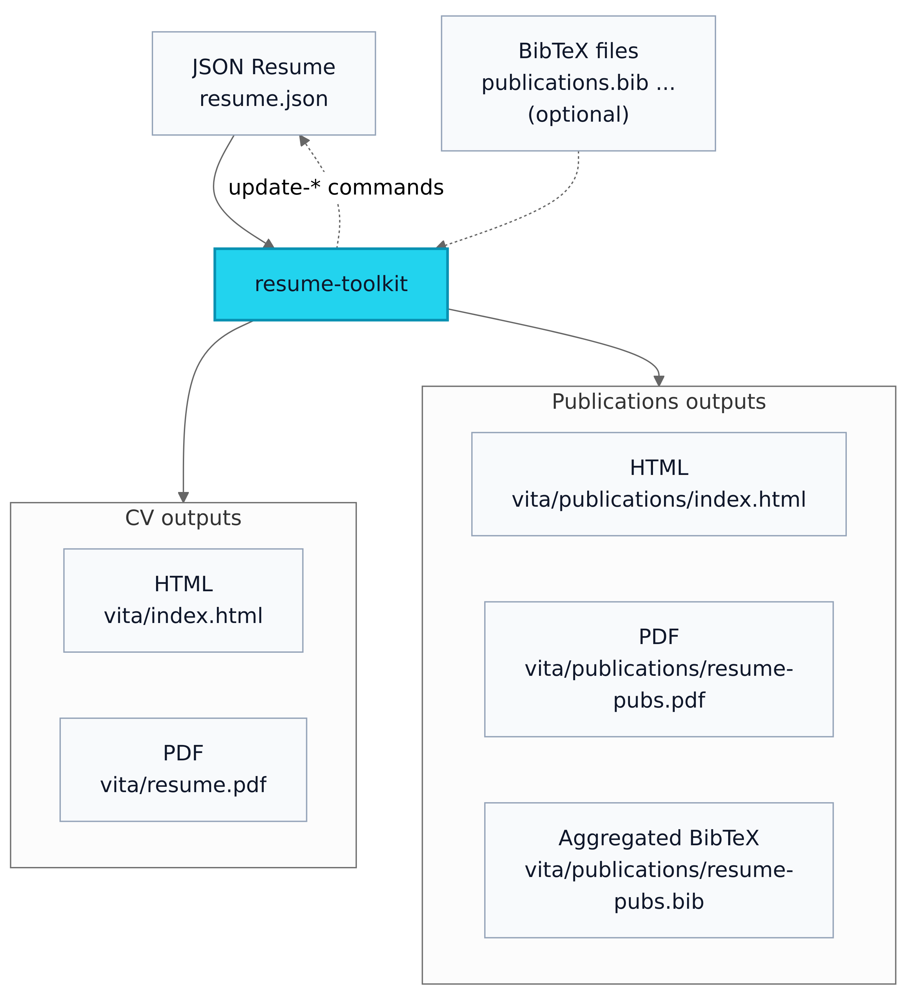
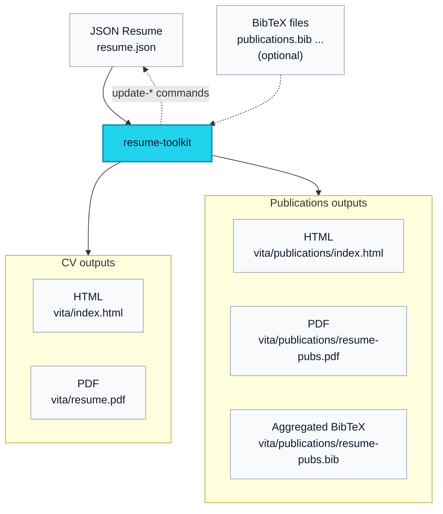

# Resume Toolkit - JSONresume/BibTeX to HTML/PDF

[](https://ghcr.io/zzamboni/resume-toolkit)
[](https://github.com/zzamboni/resume-toolkit/actions)
[](https://github.com/zzamboni/jsonresume-theme-eventide)

`resume-toolkit` allows you to produce beautiful HTML and PDF versions from your [JSON Resume](https://jsonresume.org/) (and optionally, BibTeX) files.

>[!TIP]
> **Examples:**
> 
> You can see a live real example at <https://zzamboni.org/vita/>.
> 
> You can find some further samples in the `samples/` directory:
> 
> - [`samples/example-resume/`](samples/example-resume): fully synthetic example which shows a variety of features.
> - [`samples/john-doe-brilliantcv/`](samples/john-doe-brilliantcv): the sample resume from [Brilliant-CV](https://typst.app/universe/package/brilliant-cv) (the one produced when you run `typst init @preview/brilliant-cv`) converted to JSONresume format, to show the Typst rendering abilities (the resulting PDF is nearly identical).

Convert from JSON Resume and BibTeX files into:
-   Resume HTML, using the [jsonresume-theme-eventide](https://github.com/zzamboni/jsonresume-theme-eventide) theme;
-   Resume Typst/PDF using the [brilliant-cv](https://typst.app/universe/package/brilliant-cv) theme;
-   Standalone publications HTML page (from BibTeX);
-   Standalone publications PDF (from BibTeX, rendered with Typst);
-   Aggregated publications BibTeX.

Additional functionality:
- Updating the JSON Resume file with a list of certifications from [Credly](https://credly.com/), including badges;
- Updating the JSON Resume file with a list of publications from BibTeX files (filtered by keywords and/or individual entries), and links to the standalone publications HTML page;
- Downloading company/school logos from [logo.dev](https://logo.dev), to include in both HTML and PDF outputs.


<details>
  <summary>resume-toolkit diagram source</summary>


</details>

---

<!-- markdown-toc start - Don't edit this section. Run M-x markdown-toc-refresh-toc -->
**Table of Contents**

- [Resume Toolkit - JSONresume/BibTeX to HTML/PDF](#resume-toolkit---jsonresumebibtex-to-htmlpdf)
  - [Requirements and installation](#requirements-and-installation)
  - [Quick Start](#quick-start)
  - [Output Layout](#output-layout)
  - [Main subcommands](#main-subcommands)
    - [`build` (default)](#build-default)
    - [`fetch-logos` / `update-logos`](#fetch-logos--update-logos)
    - [`update-certs`](#update-certs)
    - [`update-pub-numbers`](#update-pub-numbers)
    - [`update-inline-pubs`](#update-inline-pubs)
    - [Other subcommands](#other-subcommands)
  - [Configuration](#configuration)
    - [Bibliography configuration](#bibliography-configuration)
      - [Selecting which BibTeX entries to use](#selecting-which-bibtex-entries-to-use)
      - [Inline publications in the PDF CV](#inline-publications-in-the-pdf-cv)
      - [Full vs. filtered standalone publications output](#full-vs-filtered-standalone-publications-output)
      - [Sectioning and titles](#sectioning-and-titles)
      - [Floating links on the standalone publications page](#floating-links-on-the-standalone-publications-page)
      - [Combined example](#combined-example)
    - [Eventide theme features](#eventide-theme-features)
    - [PDF theme layout](#pdf-theme-layout)
      - [Layout overrides](#layout-overrides)
      - [Special layout keys](#special-layout-keys)
      - [PDF-only output options](#pdf-only-output-options)
      - [Relative links in PDF output](#relative-links-in-pdf-output)
      - [Notes about standalone publications PDF](#notes-about-standalone-publications-pdf)
  - [Under the Hood](#under-the-hood)
    - [Environment Variables](#environment-variables)
    - [Automated Tests](#automated-tests)

<!-- markdown-toc end -->

---

<a id="orge0cfd3e"></a>

## Requirements and installation

The recommended interface is the wrapper script `build-resume.sh`, which runs everything inside a [Docker image](https://ghcr.io/zzamboni/resume-toolkit).

- Linux or macOS (untested in Windows, should work if you can run bash scripts and have Docker installed)
- Docker or Podman (auto-detected, see also `VITA_CONTAINER_ENGINE` below)
- A file in [JSON Resume](https://jsonresume.org/) format (with optional extensions as described below)
- Optional BibTeX file(s) for publications

To install, download the [build-resume.sh](https://github.com/zzamboni/resume-toolkit/blob/main/build-resume.sh) script and make it executable:

``` sh
wget https://raw.githubusercontent.com/zzamboni/resume-toolkit/refs/heads/main/build-resume.sh
chmod a+rx build-resume.sh
```

The first time the script runs, it will download the Docker image automatically.

<a id="org90b52ae"></a>

## Quick Start

Build a Resume + publications:

```sh
build-resume.sh resume.json pubs-src/publications.bib
```

Build the bundled examples:

```sh
build-resume.sh samples/example-resume/example-resume.json --serve
```

or

```sh
build-resume.sh samples/john-doe-brilliantcv/john-doe-brilliantcv.json --serve
```

Then open <http://localhost:8080> (the port may change if you run both at the same time, see the output for the correct URL).


<a id="org1334766"></a>

## Output Layout

Default output base directory:

-   `build/<resume-stem>/`

Generated files:

- CV HTML:  `build/<resume-stem>/vita/index.html`
- CV Typst:  `build/<resume-stem>/vita/<resume-stem>.typ`
- CV PDF:  `build/<resume-stem>/vita/<resume-stem>.pdf`
- If BibTeX files are provided:
  - Publications HTML: `build/<resume-stem>/vita/publications/index.html`
  - Publications PDF: `build/<resume-stem>/vita/publications/<resume-stem>-pubs.pdf`
  - Publications aggregated BibTeX: `build/<resume-stem>/vita/publications/<resume-stem>-pubs.bib`


<a id="org8964c26"></a>

## Main subcommands

``` sh
$ build-resume.sh --help
Usage:
  build-resume.sh [--pull] [build] <resume.json> [bibfiles...] [--out <dir>] [--pubs-url <url>] [--cv-url <url>] [--watch] [--serve] [--no-fetch-logos]
  build-resume.sh [--pull] fetch-logos <resume.json> [--overwrite] [--dry-run] [--update-json] [--token LOGODEV_TOKEN]
  build-resume.sh [--pull] update-logos <resume.json> [--overwrite] [--dry-run] [--token LOGODEV_TOKEN]
  build-resume.sh [--pull] update-certs <username> <resume.json> [--include-expired] [--include-non-cert-badges] [--sort <date_desc|date_asc|name>]
  build-resume.sh [--pull] update-pub-numbers <resume.json> [--html <path>]
  build-resume.sh [--pull] version
```

<a id="org6cb0f47"></a>

### `build` (default)

```sh
build-resume.sh [--pull] [build] <resume.json> [bibfiles...] [--out <dir>] [--pubs-url <url>] [--cv-url <url>] [--watch] [--serve] [--no-fetch-logos]
```

These are equivalent:

```sh
build-resume.sh build resume.json pubs-src/publications.bib
build-resume.sh resume.json pubs-src/publications.bib
```

Options:

-   `--out <dir>`: output base directory (default `build/<resume-stem>`)
-   `--pubs-url <url>`: online publications URL for standalone publications PDF footer (can be specified in the JSON file with `meta.pdfthemeOptions.pubs_url`)
-   `--cv-url <url>`: online CV URL for main resume PDF footer (can be specified in the JSON file with `meta.pdfthemeOptions.cv_url`)
-   `--pull`: pull the configured Docker image before running and use the updated image if one is available
-   `--watch`: rebuild on input changes
-   `--serve`: start HTTP server (implies `--watch`)
-   `--no-fetch-logos`: disable automatic logo fetching when `assets/logos/` is missing

If no BibTeX files are provided on the command line, the pipeline can read them from a special entry in the `publications` section of your JSON resume:

```json
"publications": [
  {
    "authors": ["Example Person"],
    "bibfiles": ["pubs.bib", "patents.bib"]
  }
]
```

Only one `publications[]` entry may define `bibfiles`. If `--bib` arguments are provided, they take precedence. `bibfiles` entries are resolved relative to the JSON resume file location.

If no source `assets/logos/` directory is found, the pipeline will automatically try to populate it by running the logo fetcher (see [`fetch-logos`](#orgd64b9f2)). If `LOGODEV_TOKEN` is not available, the build continues but emits a warning and skips automatic logo download. Use `--no-fetch-logos` to disable both the automatic fetch and the warning.


<a id="orgd64b9f2"></a>

### `fetch-logos` / `update-logos`

Download company/institution logos from the resume file into `assets/logos/` in your working directory. Uses [logo.dev](https://www.logo.dev/) to fetch logos. You need to create an API key and provide the publishable key in the `LOGODEV_TOKEN` environment variable, or using the `--token` flag.

If matching logo files are found under `assets/logos/`, the `build` step will include them automatically in the generated PDF. You can also provide/update the images by hand with the appropriate name (`<company name>.png/jpg/jpeg/svg/webp/gif`).

If called as `update-logos` or with the `--update-json` flag, it also updates the JSON resume file by writing the matching Logo.dev URLs into the `image` field of the corresponding `work` and `education` entries.

```sh
build-resume.sh fetch-logos resume.json
```

Options:

-   `--overwrite`: rewrite image files even if they already exist
-   `--dry-run`: show what would be done
-   `--update-json`: write image URLs back into the JSON file (in the `image` field of `work`/`education` entries)
-   `--token <token>` (or set `LOGODEV_TOKEN`): publishable key from Logo.dev


<a id="orgdc97180"></a>

### `update-certs`

Sync certificates from Credly into your JSON resume. This replaces any entries in the `certificates` section of the JSONresume file that have a `url` field pointing to `credly.com`. Other entries are left untouched.

```sh
build-resume.sh update-certs <credly-username> resume.json
```

Options:

-   `--include-expired`
-   `--include-non-cert-badges`
-   `--sort <date_desc|date_asc|name>` (default `date_desc`)


<a id="orgeb8b253"></a>

### `update-pub-numbers`

Update publication reference numbers in your JSON resume using the generated publications HTML anchors.

```sh
build-resume.sh update-pub-numbers resume.json
```

Options:

-   `--html <path>` (defaults to `build/<resume-stem>/vita/publications/index.html`)


### `update-inline-pubs`

Replace inline `publications[]` entries in your JSON resume from the BibTeX selection defined by the generated-publications entry.

```sh
build-resume.sh update-inline-pubs resume.json
```

Optional BibTeX files can be passed explicitly to override the `bibfiles` configured in `publications[]`. The command keeps the single special `publications[]` entry with `bibfiles` and regenerates all other `publications[]` entries using the JSON Resume schema fields `name`, `publisher`, `releaseDate`, `url`, and `summary`.


<a id="org23204b4"></a>

### Other subcommands

```sh
build-resume.sh shell
```

Gives you an interactive shell inside the container.

## Configuration

<a id="bibliography-config"></a>

### Bibliography configuration

The toolkit can read BibTeX sources from a special `publications[]` entry in your JSON Resume. This is the preferred way to define generated publications output. For example:

```json
"publications": [
  {
    "authors": ["Example Person"],
    "bibfiles": ["pubs.bib", "patents.bib"]
  }
]
```

Rules for this entry:

-   Only one `publications[]` entry may define `bibfiles`.
-   `bibfiles` are resolved relative to the JSON resume file.
-   If `name` is omitted, it defaults to `"Full list online"`.
-   If `url` is omitted, it defaults to `"publications/"`.
-   If `--bib` arguments are provided on the command line, they take precedence over `bibfiles` from the JSON.

That `bibfiles` entry is used to generate:

-   the standalone publications HTML page
-   the standalone publications PDF
-   the downloadable aggregated BibTeX file

The regular JSON Resume `publications[]` entries are still rendered normally in the HTML CV. If you want those inline HTML publications to be generated from BibTeX, use [`update-inline-pubs`](#orgd590b0e).

#### Selecting which BibTeX entries to use

The generated-publications entry may also define:

-   `bibentries`: explicit BibTeX entry keys
-   `bibkeywords`: BibTeX `keywords` values to match

Selection is additive: an entry is included if it matches *either* `bibentries` *or* `bibkeywords`.

```json
"publications": [
  {
    "authors": ["Example Person"],
    "bibfiles": ["pubs.bib", "patents.bib"],
    "bibentries": ["example2024paper"],
    "bibkeywords": ["selected", "important"]
  }
]
```

#### Inline publications in the PDF CV

If `meta.publicationsOptions.inline_in_pdf` is enabled, the resume PDF embeds publications directly using Typst and `pergamon`. In this case any individually-specified entries in the JSON file are ignored.

-   If `inline_in_pdf` is `true`, these defaults are used:
    -   `ref-style: "ieee"`
    -   `ref-full: true`
    -   `ref-sorting: "ydnt"`
-   If `inline_in_pdf` is an object, you can override those values:
    -   `ref-style`
    -   `ref-full`
    -   `ref-sorting`

Example:

```json
"meta": {
  "publicationsOptions": {
    "inline_in_pdf": {
      "ref-style": "ieee",
      "ref-full": false,
      "ref-sorting": "ydnt"
    }
  }
}
```

The inline PDF bibliography always uses the filtered selection from `bibentries` / `bibkeywords`, when those are present.

#### Full vs. filtered standalone publications output

`meta.publicationsOptions.full_standalone_list` controls whether the standalone publications outputs use the full list from `bibfiles`, or the same filtered subset used inline in the PDF CV.

-   `true` (default): standalone publications HTML/PDF/BibTeX use the full list, while the inline PDF bibliography can still be filtered
-   `false`: standalone publications HTML/PDF/BibTeX use the same filtered subset as the inline PDF bibliography

You can also set:

-   `full_standalone_list_title`: title for the standalone publications HTML/PDF pages
    -   defaults to `"Publications"`

#### Sectioning and titles

You can configure publication sectioning for both the standalone publications page and the PDF bibliography outputs via `meta.publicationsOptions`:

-   `pubSections: false` or unset: no sectioning (single list)
-   `pubSections: true`: use the default section order and titles
-   `pubSections: ["..."]`: custom section order and selection

Section names are matched against BibTeX `keywords`. Optional title overrides go in:

-   `pubSectionTitles`

If `pubSections` is `true`, these defaults are used:

```python
DEFAULT_SECTION_ORDER = [
    "book",
    "editorial",
    "thesis",
    "refereed",
    "techreport",
    "presentations",
    "invited",
    "patent",
    "other",
]

DEFAULT_SECTION_TITLES = {
    "book": "Books",
    "editorial": "Editorial Activities",
    "thesis": "Theses",
    "refereed": "Refereed Papers",
    "techreport": "Technical Reports",
    "presentations": "Presentations",
    "invited": "Invited Talks and Articles",
    "patent": "Patents",
    "other": "Other Publications",
}
```

#### Floating links on the standalone publications page

`meta.publicationsOptions.links` controls the floating links shown on the standalone publications HTML page.

If `links` is unset, these defaults are generated:

```json
[
  {
    "name": "PDF",
    "url": "<publications>.pdf",
    "icon": "file-pdf"
  },
  {
    "name": "BibTeX",
    "url": "<publications>.bib",
    "icon": "tex"
  }
]
```

Notes:

-   `<publications>` is replaced with the generated publications file stem for the current resume
-   `<resume>` is replaced with the main resume file stem
-   If `links` is present but empty (`[]`), no floating links are rendered
-   Icons can be plain Font Awesome names such as `file-pdf`, or class-style strings such as `fa-regular fa-file-pdf` or `fa-brands fa-github`

#### Combined example

```json
"publications": [
  {
    "authors": ["Example Person"],
    "bibfiles": ["pubs.bib", "patents.bib"],
    "bibkeywords": ["selected", "important"],
    "bibentries": ["example2024paper"]
  }
],
"meta": {
  "publicationsOptions": {
    "inline_in_pdf": {
      "ref-style": "ieee",
      "ref-full": false,
      "ref-sorting": "ydnt"
    },
    "full_standalone_list": true,
    "full_standalone_list_title": "Research Output",
    "links": [
      {
        "name": "PDF",
        "url": "<publications>.pdf",
        "icon": "file-pdf"
      },
      {
        "name": "BibTeX",
        "url": "<publications>.bib",
        "icon": "tex"
      }
    ],
    "pubSections": ["refereed", "patent", "other"],
    "pubSectionTitles": {
      "refereed": "Journal Articles",
      "patent": "Patents",
      "other": "Other Publications"
    }
  }
}
```

<a id="eventide-theme-config"></a>

### Eventide theme features

The HTML theme used by this toolkit is [jsonresume-theme-eventide](themes/jsonresume-theme-eventide/README.md), which is the source of truth for HTML theme configuration and behavior.

In `resume-toolkit`, all `meta.themeOptions` values are passed through to Eventide for HTML rendering. The toolkit also adds a few defaults before rendering:

-   if `meta.themeOptions.links` is not set, default floating links are generated for the resume PDF and, when applicable, the standalone publications page
-   if `meta.themeOptions.footer_right` is not set, it defaults to `Powered by [resume-toolkit](https://github.com/zzamboni/resume-toolkit)`
-   `<resume>` and `<publications>` placeholders in `meta.themeOptions.links[*].url` are expanded before rendering

A small subset of `meta.themeOptions` also affects PDF rendering:

-   `sections`: controls section order and selection in both HTML and PDF
-   `sectionLabels`: controls section labels in both HTML and PDF
-   `projectsByType`: controls project grouping in both HTML and PDF

For inline PDF publications, `sectionLabels.publications` is also used as the fallback publications section label unless overridden by `meta.publicationsOptions.full_standalone_list_title`.

### PDF theme layout

PDF output is rendered with Typst using the `brilliant-cv` package. Toolkit-specific PDF options live under `meta.pdfthemeOptions`.

#### Layout overrides

`meta.pdfthemeOptions.layout` is deep-merged into the default `metadata.layout` used for the generated Typst document.

Current defaults are:

```python
DEFAULT_PDF_THEME_LAYOUT = {
    "awesome_color": "skyblue",
    "before_section_skip": "1pt",
    "before_entry_skip": "1pt",
    "before_entry_description_skip": "1pt",
    "paper_size": "a4",
    "fonts": {
        "regular_fonts": ["Source Sans 3"],
        "header_font": "Roboto",
    },
    "header": {
        "header_align": "left",
        "display_profile_photo": True,
        "profile_photo_radius": "50%",
        "info_font_size": "10pt",
    },
    "entry": {
        "display_entry_society_first": True,
        "display_logo": True,
    },
    "footer": {
        "display_page_counter": False,
        "display_footer": True,
    },
}
```

Any fields you do not set keep these defaults.

Example:

```json
{
  "meta": {
    "pdfthemeOptions": {
      "layout": {
        "awesome_color": "red",
        "header": {
          "header_align": "center",
          "info_font_size": "9pt"
        },
        "footer": {
          "display_page_counter": true
        }
      }
    }
  }
}
```

#### Special layout keys

Three keys under `meta.pdfthemeOptions.layout` are handled specially by the toolkit rather than being passed directly into `metadata.layout`:

- `highlighted`
- `letters`
- `summary_title`

`highlighted` and `letters` control how section titles are rendered in the generated Typst:

- if they are set, they are passed explicitly to `#cv-section(...)`
- if they are omitted, nothing is passed, so `brilliant-cv` uses its own defaults

`summary_title` controls whether a non-empty summary is preceded by a `Summary` heading in the PDF. It defaults to `false`.

Example:

```json
{
  "meta": {
    "pdfthemeOptions": {
      "layout": {
        "highlighted": false,
        "letters": 3,
        "summary_title": true
      }
    }
  }
}
```

#### PDF-only output options

At the `meta.pdfthemeOptions` level, the toolkit also supports:

- `visible_urls`
- `cv_url`
- `pubs_url`

`visible_urls` controls where compact printable URLs are shown in the PDF output. It defaults to:

```json
["notes"]
```

Supported values are:

- `notes`
- `profiles`
- `projects`
- `all`
- `none`

`cv_url` is shown in the footer of the main CV PDF.

`pubs_url` is shown in the footer of the standalone publications PDF.

Command-line `--cv-url` and `--pubs-url` values override these config entries.

Example:

```json
{
  "meta": {
    "pdfthemeOptions": {
      "visible_urls": ["notes", "profiles"],
      "cv_url": "https://example.com/vita/",
      "pubs_url": "https://example.com/vita/publications/"
    }
  }
}
```

#### Relative links in PDF output

If you set `meta.site.url`, relative links remain relative in HTML output but are resolved against that base URL in generated PDF output. This applies to:

-   explicit `url` fields
-   Markdown links embedded in text fields such as `summary` or `highlights`

#### Notes about standalone publications PDF

The standalone publications PDF uses the same `meta.pdfthemeOptions.layout` settings and section-title styling, but it also forces a few document-specific overrides:

- the profile photo is always disabled
- the footer label uses the standalone publications title
- `meta.pdfthemeOptions.pubs_url` is rendered in that footer when set

<a id="orgc2ef02d"></a>

## Environment Variables

Some behavior can be configured using environment variables. The only mandatory one (if you want to fetch logos) is `LOGODEV_TOKEN`.

-   `LOGODEV_TOKEN`: token used by `fetch-logos`
-   `VITA_PIPELINE_IMAGE`: Docker image (default: `ghcr.io/zzamboni/resume-toolkit:latest`)
-   `VITA_CONTAINER_ENGINE`: container engine to use (`docker` or `podman`). If unset, `docker` is used when available, otherwise `podman`.
-   `VITA_SERVE_PORT`: serve port (default: `8080`)
-   `VITA_PIPELINE_CACHE_DIR`: host cache dir for container caches


<a id="org79da12a"></a>

## Under the Hood

The wrapper runs:

-   containerized entrypoint in `docker/entrypoint.sh`
-   pipeline script `scripts/run_pipeline.sh`
-   supporting converters in `scripts/`

The container uses `themes/jsonresume-theme-eventide` as a git submodule, pointing to <https://github.com/zzamboni/jsonresume-theme-eventide>.

Clone with submodules enabled:

```sh
git clone --recurse-submodules https://github.com/zzamboni/resume-toolkit.git
```

If you already cloned without submodules:

```sh
git submodule update --init --recursive
```

You can build the Docker image locally with:

``` sh
mise toolkit-image-build
```

<a id="org487a931"></a>

### Automated Tests

Container integration tests live under `tests/container/`.

Run tests:

```sh
mise test-toolkit
```
