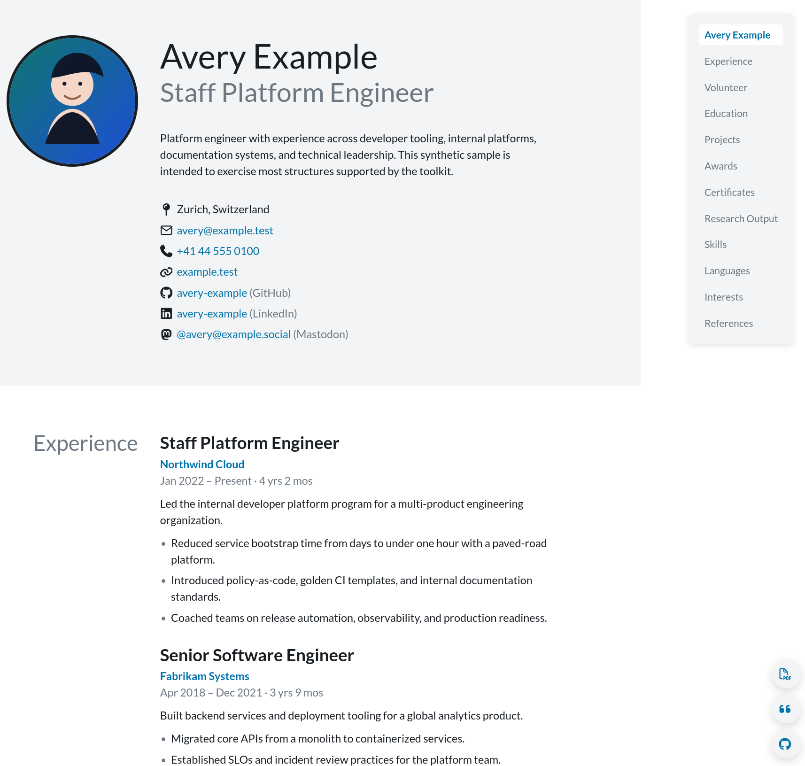
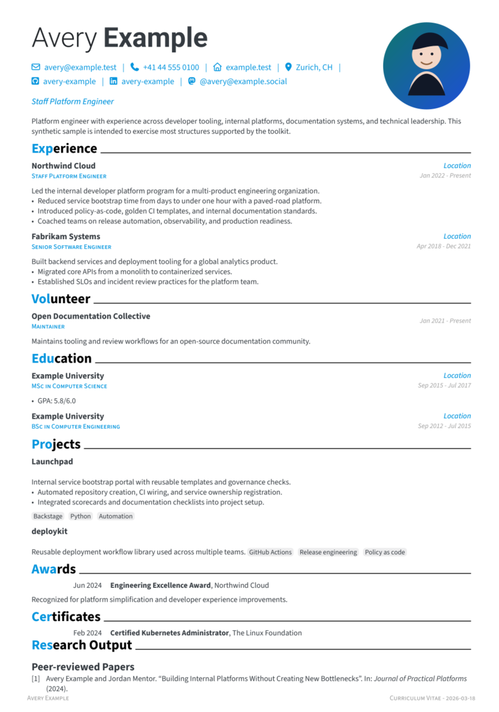

# Sample Resume

This directory contains a synthetic example intended to exercise most of the
toolkit's features without depending on personal data.

Files:

- `example-resume.json`: JSON Resume input with theme and publications options
- `example-publications.bib`: BibTeX source for generated publications output
- `example-profile.svg`: local profile image referenced by the sample resume

Build it from the repository root:

```sh
./build-resume.sh samples/example-resume/example-resume.json
```

The generated output will be written under:

```text
build/example-resume/vita/
```

## Screenshots

HTML output:


PDF output:

