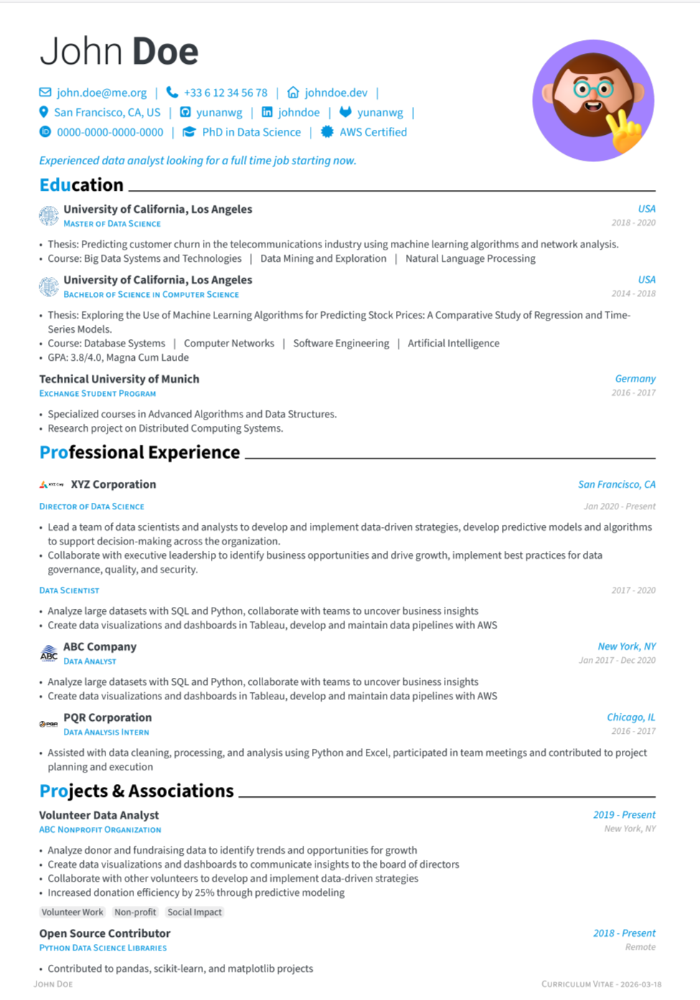

# Converted Brilliant-CV Sample

This sample is a JSON Resume conversion of the
[Brilliant-CV](https://typst.app/universe/package/brilliant-cv) English example
(the one produced when you run `typst init @preview/brilliant-cv`).

Build it from the repository root:

```sh
./build-resume.sh samples/john-doe-brilliantcv/john-doe-brilliantcv.json
```

## Screenshots

HTML output:


PDF output:

